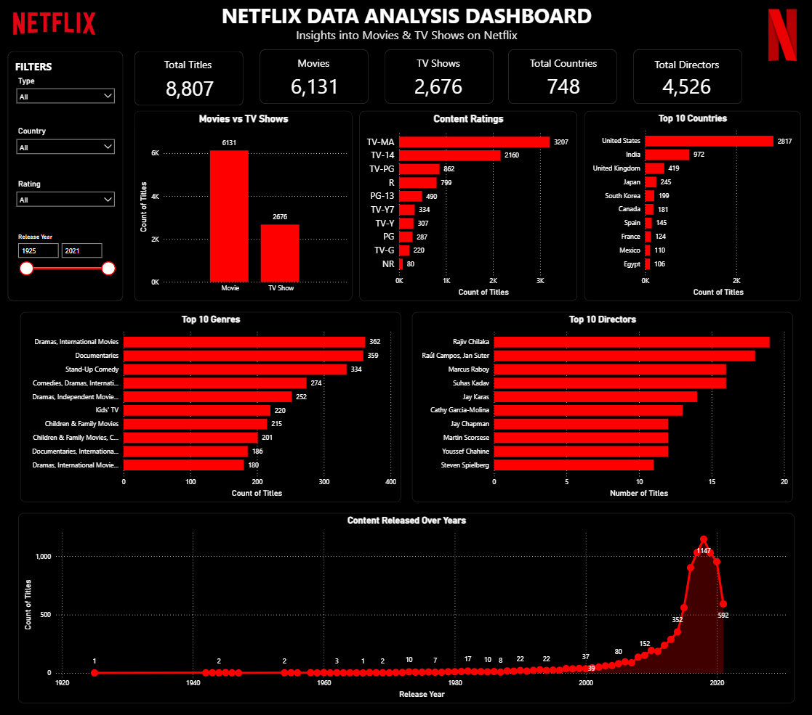

# 📊 Power BI Dashboard

## 📌 Overview

This folder contains the interactive Power BI dashboard developed for the Netflix Data Analysis project. The dashboard provides visual insights into Netflix Movies and TV Shows, helping users understand content distribution, ratings, genres, countries, and release trends.

---

## 📊 Dashboard Features

- KPI Cards
- Movies vs TV Shows
- Top 10 Content Ratings
- Top 10 Countries
- Top 10 Genres
- Release Year Trend
- Top 10 Directors
- Interactive Filters and Slicers

---

## 📈 KPIs

- Total Titles
- Total Movies
- Total TV Shows
- Total Countries

---

## 📊 Visualizations

- Bar Chart – Movies vs TV Shows
- Bar Chart – Top Ratings
- Bar Chart – Top Countries
- Bar Chart – Top Genres
- Line Chart – Release Year Trend
- Bar Chart – Top Directors

---

## 🎯 Business Insights

- Movies dominate the Netflix catalog.
- The United States has the largest content library.
- Drama and International Movies are among the most common genres.
- Netflix content has grown significantly over the years.
- TV Shows represent a smaller but steadily growing share of the platform.

---

## 📂 File

- **Netflix.pbix** – Interactive Power BI Dashboard

---

## 📷 Dashboard Preview

---

This Power BI dashboard provides an interactive view of Netflix content and complements the Excel, SQL, and Python analyses by enabling users to explore trends, content distribution, and key business insights visually.
